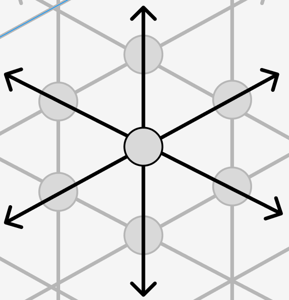

# Physicality

The currently accepted theory is that our reality is made up of quanta. Quanta is the smallest unit of measure of reality.

In the larger context of general infinity, our smallest unit of measure, our quanta, is the smallest observable unit we are able to subset from infinity.

The shape of this quantum is measure in our definition of space, which is an X,Y,Z measurement with optional time dimension.

The topic here is not about the definition of quanta. I will leave that to the experts.

Given our current capabilities, quanta are the smallest subset of general infinity that we're able to observe.

The point I want to raise is this:

An observer's reality's quanta is the smallest subset the observer is able to achieve with or without assistance.

Quanta is, for the human race, the singular smallest observable point at which general infinity is subsetted as our reality. In other words the entry point of infinity into reality = quanta.

The exact definition of quanta may change as we learn more through advances in technology, but the point stands - this is the smallest measure of infinity, the smallest subset of infinity we're able to postulate, detect or observe. For different species with different advances in technology this will be different. A dog is no more able to reduce its observable physicality to anything less than trillions of atoms, a tree or a bush or some bone. As humans we're able to reduce this to a smaller subset through the use of technology.

Should this technology change in the future, then the future smallest unit will become the new entrypoint of infinity into our range of observation, and reality will be redefined based on that definition.

When a quantum is observed repeatedly, this string of observations is time. Whatever the shape of the quantum is, continued observations at intervals of the same spacing is the passing of time, which is the observation of the smallest subset of infinity at set intervals.